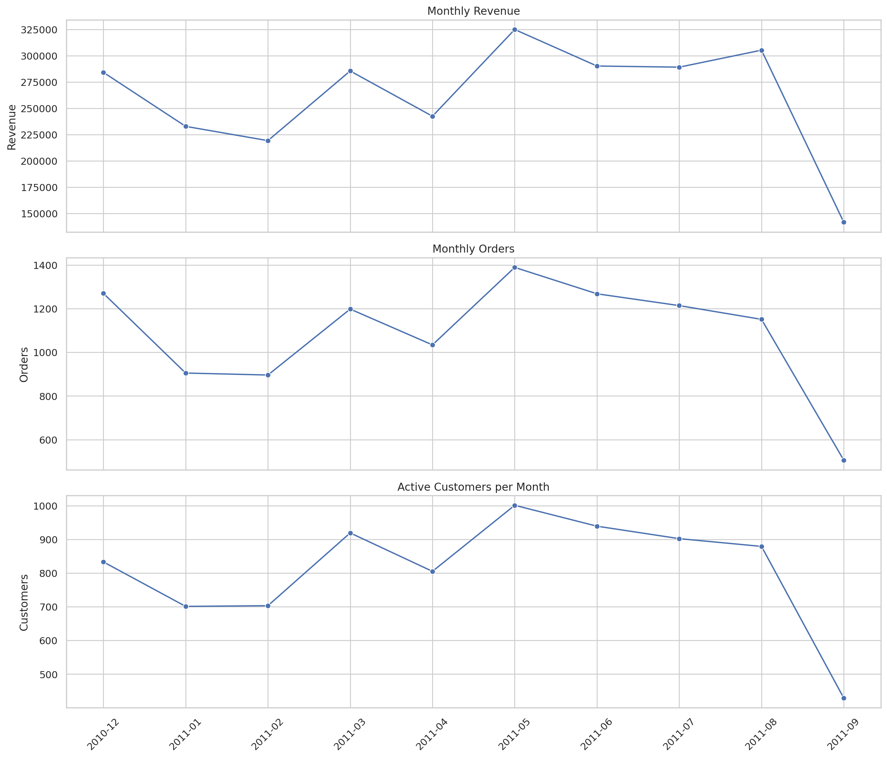
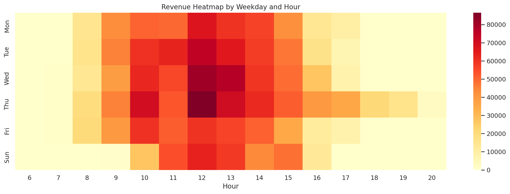
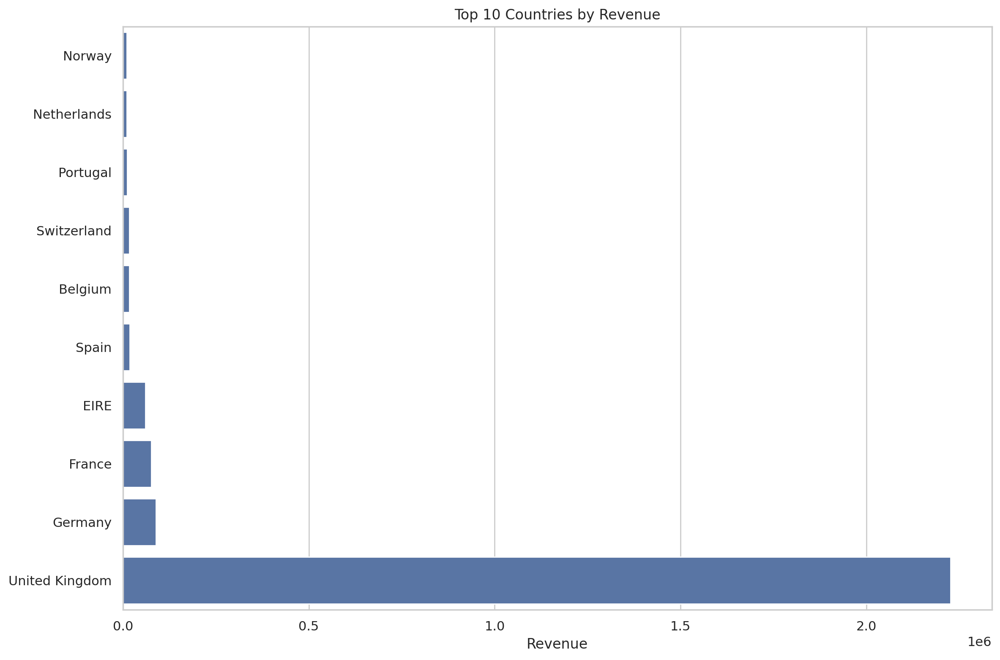
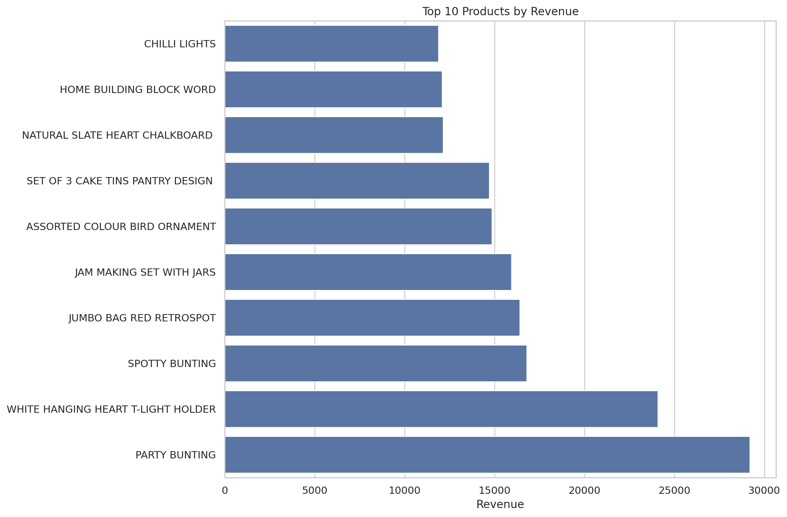
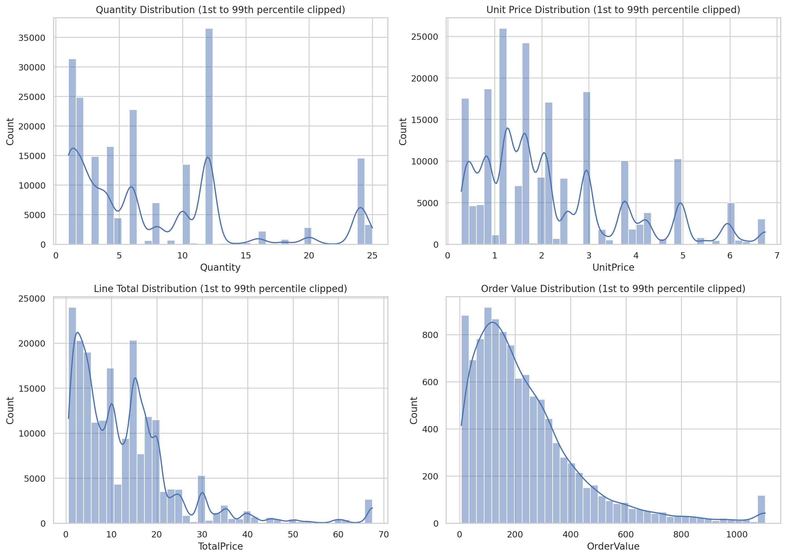
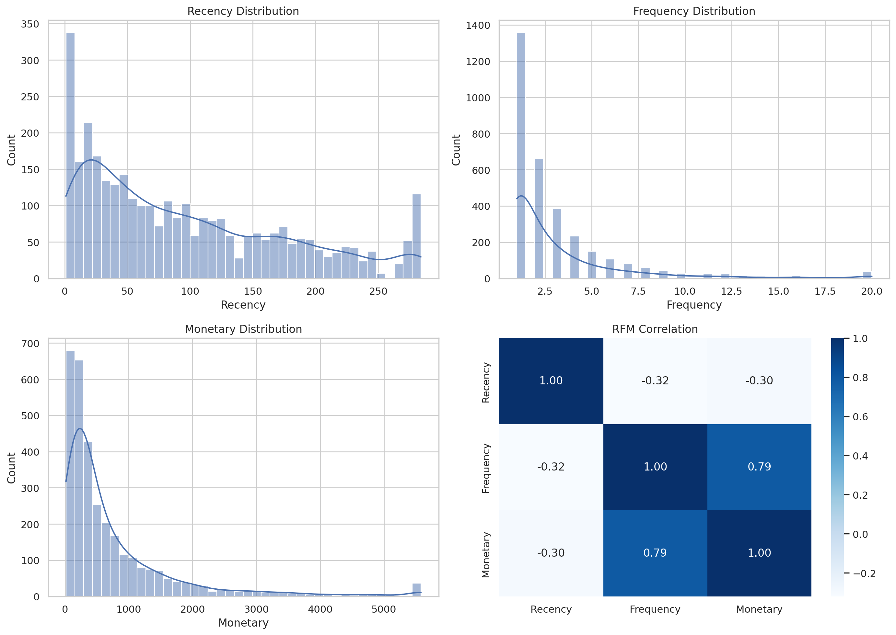

# Retail Dataset EDA Report

Generated: 2026-04-08 02:17:06

## Scope

This report profiles the transactional retail dataset in `raw data/rt_data.csv` and the companion customer-level file in `summary metrics/RFM data.csv`.

## Dataset Overview

```text
             metric                    value
               Rows                  197,316
            Columns                       13
           Invoices                   10,831
          Customers                    3,256
           Products                    3,168
          Countries                       36
      Date coverage 2010-12-01 to 2011-09-12
      Total revenue             2,614,899.28
Average order value                   241.43
 Median order value                   186.64
```

## Data Quality Checks

```text
                      check  value
             Duplicate rows      0
Rows with any missing value      0
    Rows with UnitPrice = 0     14
    Rows with Quantity <= 0      0
   Rows with TotalPrice = 0     14
```

Missing values by column:

```text
InvoiceNo      0
StockCode      0
Description    0
Quantity       0
InvoiceDate    0
UnitPrice      0
CustomerID     0
Country        0
TotalPrice     0
Year           0
Month          0
Day            0
DayOfWeek      0
```

Interpretation: invoice identifiers are numeric, all quantities are positive, and no line totals are negative. That strongly suggests returns and cancelled orders were removed before this file was created.

## Time-Series Patterns



```text
 period   revenue  orders  customers
2010-12 284122.15    1270        833
2011-01 232767.98     905        701
2011-02 219192.88     896        703
2011-03 285458.42    1198        919
2011-04 242420.68    1034        805
2011-05 324899.44    1389       1001
2011-06 290158.85    1268        939
2011-07 289068.99    1214        902
2011-08 305233.84    1151        879
2011-09 141576.05     506        429
```



```text
weekday   revenue  orders
    Mon 408752.39    1597
    Tue 453480.37    1812
    Wed 472842.84    1994
    Thu 575752.06    2414
    Fri 395453.63    1657
    Sun 308617.99    1357
```

## Geographic and Product Concentration



```text
       Country    revenue  orders  customers  rev_per_customer
United Kingdom 2225758.14    9754       2930            759.64
       Germany   88688.15     270         73           1214.91
        France   75871.02     228         70           1083.87
          EIRE   61046.79     144          3          20348.93
         Spain   18984.18      55         21            904.01
       Belgium   17213.58      65         24            717.23
   Switzerland   16768.07      28         17            986.36
      Portugal   11971.49      27         13            920.88
   Netherlands   10706.94      42          7           1529.56
        Norway   10149.27      15          8           1268.66
```



```text
StockCode                        Description  revenue  qty  orders
    47566                      PARTY BUNTING 29193.15 5923    1012
   85123A WHITE HANGING HEART T-LIGHT HOLDER 24083.50 8194    1182
    23298                     SPOTTY BUNTING 16794.20 3392     663
   85099B            JUMBO BAG RED RETROSPOT 16398.14 8070     850
    22960           JAM MAKING SET WITH JARS 15940.00 3947     616
    84879      ASSORTED COLOUR BIRD ORNAMENT 14861.86 8794     727
    22720  SET OF 3 CAKE TINS PANTRY DESIGN  14700.85 3055     762
    22457    NATURAL SLATE HEART CHALKBOARD  12140.24 4116     654
    21754           HOME BUILDING BLOCK WORD 12078.05 2067     525
    79321                      CHILLI LIGHTS 11878.15 2401     287
```

## Basket and Transaction Shape



Average order value is 241.43 and median order value is 186.64. The average order contains 18.22 line items and 141.87 units.

The top zero-price rows are shown below for review:

```text
 InvoiceNo StockCode                        Description  Quantity  CustomerID        Country
    537197     22841       ROUND CAKE TIN VINTAGE GREEN         1     12647.0        Germany
    539263     22580       ADVENT CALENDAR GINGHAM SACK         4     16560.0 United Kingdom
    539722     22423           REGENCY CAKESTAND 3 TIER        10     14911.0           EIRE
    540372     22090            PAPER BUNTING RETROSPOT        24     13081.0 United Kingdom
    540372     22553             PLASTERS IN TIN SKULLS        24     13081.0 United Kingdom
    541109     22168      ORGANISER WOOD ANTIQUE WHITE          1     15107.0 United Kingdom
    543599    84535B       FAIRY CAKES NOTEBOOK A6 SIZE        16     17560.0 United Kingdom
    548318     22055 MINI CAKE STAND  HANGING STRAWBERY         5     13113.0 United Kingdom
    548871     22162        HEART GARLAND RUSTIC PADDED         2     14410.0 United Kingdom
    550188     22636 CHILDS BREAKFAST SET CIRCUS PARADE         1     12457.0    Switzerland
```

## RFM Profile



RFM descriptive statistics:

```text
       Recency  Frequency  Monetary
count  3256.00    3256.00   3256.00
mean     96.24       3.33    803.10
std      80.41       5.30   1482.56
min       1.00       1.00      1.25
25%      27.00       1.00    177.28
50%      75.00       2.00    379.48
75%     153.00       4.00    908.27
max     285.00     126.00  42751.82
```

RFM outlier summary:

```text
   metric  outliers  share_pct  lower_bound  upper_bound
  Recency         0       0.00       -162.0       342.00
Frequency       225       6.91         -3.5         8.50
 Monetary       281       8.63       -919.2      2004.75
```

RFM correlation matrix:

```text
           Recency  Frequency  Monetary
Recency      1.000     -0.319    -0.298
Frequency   -0.319      1.000     0.788
Monetary    -0.298      0.788     1.000
```

## Key Insights

1. The dataset is already heavily cleaned. It has no missing values, no duplicate rows, no negative quantities, and no negative line totals. The only residual anomaly is 14 zero-price rows, which likely represent freebies or promotional items.
2. Revenue is concentrated in the United Kingdom, which contributes 85.12% of total revenue. The top five countries together contribute 94.47%, so international demand exists but diversification is limited.
3. Commercial activity is strongest from May through August 2011, with the revenue peak in 2011-05 at 324,899.44. September 2011 is materially lower, but it is also a partial month because the file stops on 2011-09-12.
4. Customer behavior is repeat-driven but still long-tailed. 58.26% of customers placed more than one order, yet the top 10 customers contribute only 6.97% of revenue and the top 100 contribute 24.03%. That points to a broad base instead of dependence on only a few accounts.
5. Thu is the strongest trading day by revenue at 575,752.06, and the revenue heatmap shows the busiest trading window is midday, especially between 12:00 and 14:00. There are no Saturday transactions in this file.
6. The RFM summary is suitable for segmentation, but Frequency and Monetary are strongly right-skewed and contain outliers. Frequency and Monetary correlate at 0.788, while Recency is moderately negative against Frequency (-0.319) and Monetary (-0.298). For KMeans, log-scaling Monetary and Frequency before standardization would reduce distortion from heavy spenders.

## Recommended Next Steps

1. Standardize the RFM input after applying a log transform to Monetary and Frequency.
2. Decide whether zero-price lines should be excluded before customer segmentation.
3. Treat December 2010 and September 2011 as partial periods when comparing monthly performance.
4. Validate whether the extreme per-customer revenue in EIRE reflects legitimate wholesale accounts.